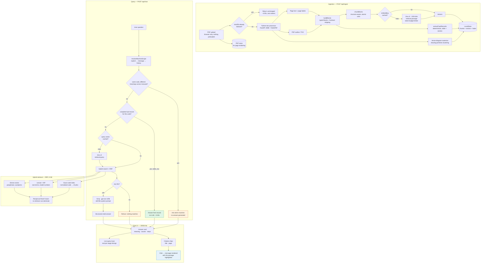

# FaultFinder — RAG Architecture

Turns a cryptic machine error code into a cited, page-referenced repair
procedure, drawn only from manuals the user has uploaded.

> **Accuracy note.** This document describes the system as it is implemented
> today. Where something is built but not yet wired into the live request path,
> it says so explicitly rather than describing intent as fact.

## System Overview

## Why these choices

### Structure-aware chunking, not fixed-size splitting

The obvious approach — split every 1000 characters with 200 overlap — destroys
exactly what a troubleshooting manual encodes. A fault table row binds a code to
its meaning, cause and remedy; cutting it in half produces a chunk that says
"E101" and another that says "reseat the connector", and neither can answer the
question.

`chunkBlocks` therefore treats **tables, step lists, admonitions and figures as
atomic** — they are never split across chunks. When a table genuinely exceeds
the budget it is split *by rows* with the header repeated in every part, and the
parts are labelled so a technician knows there is more. Each chunk carries a
breadcrumb prefix (`Manual › Section › Subsection`) *inside* the embedded text,
so the machine and section are part of what the retriever matches on.

The test suite asserts this directly: *"a fault table stays in ONE chunk and is
marked atomic"*, *"a warning is never separated from the step it belongs to"*,
*"a step list is not cut mid-procedure"*.

### Hybrid retrieval with RRF, not cosine alone

Three retrievers answer different question shapes:

| Retriever | Answers | Why it is needed |
|---|---|---|
| Exact code index | "OCF", "F0001", "b005" | A code lookup must never depend on vector luck |
| Lexical + IDF | model numbers, rare terms | Dense vectors blur rare exact tokens |
| Dense cosine | "why is the press overheating" | Symptom language never matches manual wording |

They are fused with **Reciprocal Rank Fusion** (`K=60`) rather than a weighted
score sum, because RRF consumes only *rank*. No retriever can dominate by
inflating its own score scale, which is the failure mode of naive score mixing.
Exact code hits enter the fusion at rank 0 because they are lookups, not
guesses.

Machine filtering happens **before** ranking, not after, so a query scoped to
one machine cannot be crowded out by another manual's chunks.

### Deterministic answers where they exist

`extractFaultRecords` pulls `code → meaning → causes → steps` out of fault
tables and per-code sections at ingest time. When a query names a single code
that resolves to one complete record, the answer is returned **straight from the
record with no LLM call** — a few milliseconds, and no opportunity to
hallucinate, because nothing is generated.

This path is gated by `isFastPathQuality`: it fires only for `table_row`
extractions with a meaning and between 1 and 12 steps. That gate exists because
it caught a real regression — a section-extracted record returned 19 mangled
"steps" (five of which were actually causes, and sentences split mid-clause)
while the LLM path returned the correct 5 steps and 5 causes. **3.5s correct
beats 0.02s wrong**, so thin records fall through to the full pipeline.

### Hosted embeddings with an account-wide token budget

Jina `jina-embeddings-v3` at 1024 dimensions, using asymmetric task types
(`retrieval.passage` for chunks, `retrieval.query` for questions), which
measurably improves recall over embedding both sides identically. It is
multilingual across 89 languages, which makes the multilingual requirement
largely free.

The free tier caps **tokens per minute**, not requests, so the client carries a
sliding-window `TokenRateLimiter`. This exists because of a bug we caused:
adding concurrency alone fired roughly 102,660 tokens in one instant against a
100,000/min limit. Workers must now *reserve* budget before sending. The limiter
is module-level because the quota is account-wide — a per-instance limiter hands
every concurrent request its own full budget and 429s immediately.

## Caching and idempotency

Four caches, all lossless:

| Cache | Key | Measured effect |
|---|---|---|
| Ingest idempotency | file sha256 | identical re-upload: 73s → **0.05s** |
| Embedding cache | sha256(model:dims:text) | delete + re-upload: **792/792 hits**, zero tokens |
| Duplicate collapsing | exact chunk text within a document | **11.6%** of a 456-page manual embedded once |
| Query-vector LRU | query string, max 500 | repeat query: **1.6s → 1ms** |
| Page-image LRU | doc + page + highlight, max 24 | re-opening a cited page is instant |

The embedding cache refuses to load if the model or dimension count differs, so
switching providers can never silently mix incompatible vector spaces.

## Components

### Python doc-processor — FastAPI, port 8080

| Endpoint | Purpose |
|---|---|
| `POST /parse` | page text, page labels, embedded images, outline |
| `POST /page-image` | render one page to PNG, optionally highlighting a passage |
| `POST /chunk`, `POST /process` | legacy chunking path |

Vector-drawn diagrams (schematics, wiring, flowcharts) are not embedded images
and are invisible to image extraction. They are recovered by spatially
clustering drawing primitives and rasterizing dense clusters, discriminated by
ops-density and word-density thresholds.

### Node RAG package — `packages/rag`

`doc/model.ts` (types, code and unit extraction) · `doc/blocks.ts` (typed blocks,
header/footer stripping) · `doc/tables.ts` · `doc/faults.ts` ·
`doc/chunker.ts` · `store/local-store.ts` (hybrid store + RRF) ·
`store/embed-cache.ts` · `embeddings-jina.ts`.

### Next.js app — port 3000

`POST /api/ingest` · `GET /api/ingest/progress` · `POST /api/chat` ·
`GET /api/chat/progress` · `GET /api/page` · `GET /api/stats` ·
`DELETE /api/documents`.

## Storage, and what it means for deployment

`LocalStore` persists to `.data/index.json` and uploaded PDFs to `.data/pdfs/`,
both written temp-then-rename so a crash cannot truncate them. Ingest progress
and query traces live in per-process `globalThis` maps.

**This is a deliberate stopgap and the main deployment gap.** A read-only
serverless filesystem cannot host it, and `globalThis` state is not shared
across instances. The store interface was shaped for the swap — vectors to
Qdrant Cloud, PDFs to object storage, traces to a shared cache — but that
migration has not been done.

**Current scale characteristics, stated honestly:** search is O(n) cosine across
every vector per query, the whole index is parsed into memory on cold start, and
diagram images are base64 inside the index. At the current ~1,300 chunks this is
imperceptible. It does not survive 100k chunks; the fix is an ANN index
(Qdrant + HNSW, O(log n)), not a tuning change.

## Tech stack

| Layer | Technology | Cost |
|---|---|---|
| Frontend | Next.js 16, React 19, Tailwind 4 | Free |
| API | Next.js route handlers | Free |
| Doc processing | Python FastAPI + PyMuPDF | Free |
| Embeddings | Jina `jina-embeddings-v3`, 1024-dim | Free tier |
| Vector store | `LocalStore` (disk JSON, hybrid + RRF) | Free |
| LLM | Groq `openai/gpt-oss-120b` | Free tier |

## Measured performance

ACS150, 172 pages, unless noted.

| Operation | Result |
|---|---|
| Cold ingest | 67s (90–95% of it embedding) |
| Identical re-upload | 0.05s |
| Delete + re-upload | 4.7s (full cache hit) |
| Parse only | 3.2s (172pp) · 7.6s (460pp) |
| Fault fast path | ~0.02s, no LLM call |
| Query, vector cached | ~1ms to retrieval |
| Typical end-to-end query | 1.6s retrieval + ~7s generation |

Two optimizations were tried and **reverted** after measurement:
`get_cdrawings()` was 2× faster in isolation but tuple→`Rect` conversion made
IRB4600 parsing 36.5s → 81s; a text-density pre-filter for diagram pages was
abandoned because diagram pages average 2,236 characters against 2,330 for
non-diagram pages, so no threshold separates them.

## Related

- [Hallucination control](./hallucination-control-framework.md)
- [RAG stats](./rag-stats.md)
- [Setup](../SETUP.md)
