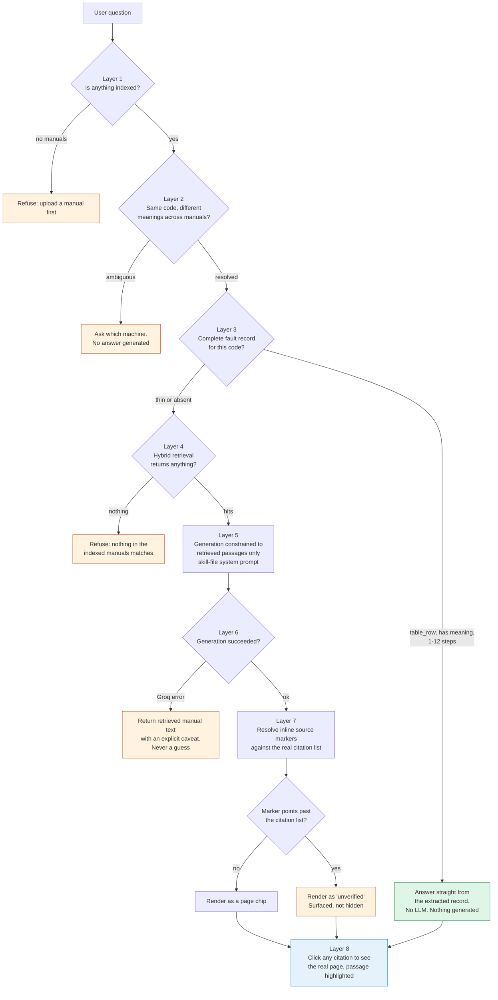

# Hallucination Control

> **Status honesty.** An earlier version of this document described a five-stage
> verification pipeline as if it were running, and included a before/after table
> claiming a drop from ~35% to ~5% hallucination rate and ~60% to ~95% citation
> accuracy. **Those numbers were never measured, and that pipeline is not wired
> into the live request path.** Both have been removed. This document now
> separates what runs today from what is written but not yet integrated, and
> claims no number that has not been observed.

## The problem

An LLM asked about a machine it has thin evidence for will produce a confident,
fluent, plausible repair procedure. On a factory floor that is worse than
silence: a technician acting on an invented step can damage equipment or get
hurt. "Don't hallucinate" in a system prompt is not a control — it is a request.

Our approach is therefore **layered**, and the strongest layers are the ones
where the model has no opportunity to invent anything at all.

## The layers that run today



### Layer 1 — Empty-index refusal

If nothing is indexed, the request never reaches the model. `app/api/chat/route.ts`
returns a refusal telling the user to upload a manual.

*Deterministic. No model involved.*

### Layer 2 — Cross-document ambiguity

`checkAmbiguity` groups every fault record sharing a normalised code by machine.
If two or more machines document the same code **with materially different
meanings**, the system returns a clarifying question and generates no answer.

The comparison is a normalised-string check on the meanings, not an embedding
call, so it is free and repeatable. Records that agree do not trigger a question
— asking "which machine?" when both manuals say the same thing is noise, not
safety.

Once a machine is known — named explicitly, in the current message, or carried
forward from history — this layer is skipped, so a follow-up like *"and what if
that doesn't fix it?"* does not re-interrogate the user.

*Deterministic. No model involved.*

### Layer 3 — Deterministic answers from extracted records

The strongest layer: when the answer already exists as structured data, it is
returned verbatim and **the LLM is never called**. A model that is not invoked
cannot hallucinate.

`isFastPathQuality` gates this to records that are actually trustworthy:

```
extraction === "table_row"   // table structure, not prose heuristics
meaning is non-empty
1 <= steps <= 12
```

Every one of those conditions was added in response to an observed failure. A
section-extracted record produced 19 "steps" — five of which were probable
causes, with sentences split mid-clause — where the LLM path produced the
correct 5 steps and 5 causes. Speed is not worth a worse answer, so anything
thinner falls through.

*Deterministic. No model involved.*

### Layer 4 — Retrieval floor

If hybrid retrieval returns nothing for the query, the system refuses and
suggests naming the machine or an exact code. Empty context is never sent to the
model, because a model given no evidence and a question will answer anyway.

*Deterministic. No model involved.*

### Layer 5 — Constrained generation

Only when layers 1–4 pass does generation happen, against the retrieved
passages, using the system prompt in
`apps/web/lib/prompts/hallucination-skill.md` — a real file loaded at runtime,
not an inline string, so its rules are reviewable and diffable.

*This is the one prompt-based layer, and it is deliberately the weakest link in
the chain rather than the only one.*

### Layer 6 — Honest degradation

If Groq fails — rate limit, outage, malformed output — the system does **not**
retry into a guess. It returns the retrieved manual text with an explicit
caveat naming the cause:

> *"The answer-generation model returned an error (429), so this is the
> retrieved manual text rather than a generated answer."*

Distinct messages per failure path, so a missing API key is never reported as a
retrieval failure.

*Deterministic.*

### Layer 7 — Citation markers resolved, not trusted

The model emits inline source references (`【S1】` or `[S1]`). These are resolved
against the **actual** citation list:

- resolves to a real citation → rendered as a page chip carrying the real page
  number
- **points past the end of the list** → rendered as an `unverified` chip

That second case means the model referenced a source that was not returned. It
is surfaced rather than deleted, because silently removing it would hide exactly
the signal this product exists to catch.

Matching is deliberately narrow (`S` followed only by digits), because manuals
are full of genuine bracketed parameter names — `[Settings]`, `[Motor control]`,
`[Fault Reset Assign]` — which must survive untouched.

*Deterministic. Post-generation.*

### Layer 8 — Verifiable by the reader

Every citation is clickable and renders the real page from the stored PDF, with
the retrieved passage highlighted. This is the layer no automated check can
replace: the reader can confirm the claim against the source in one click.

Highlighting is best-effort by design — a passage that cannot be located renders
a clean page rather than a misleading mark.

Related: the diagram guard. Image extraction pulls every raster off a cited
page, which on real manuals includes page furniture (57×57 wrench and info
glyphs). Anything too small to be a figure is dropped rather than presented as
"a diagram from the manual".

## Built, not yet wired

`packages/rag/src/hallucination-control.ts` implements five further checks:

| Function | Intent |
|---|---|
| `scoreGate` | reject retrieval below a similarity floor |
| `evidenceCoverageCheck` | require query terms to appear in retrieved text |
| `detectMachineAmbiguity` | ambiguity detection over hits |
| `verifyCitations` | check answer claims against cited chunk text |
| `checkFactualConsistency` | keyword-overlap support scoring |
| `runHallucinationControl` | orchestrates the above |

**None of these are imported anywhere in the application.** They are complete,
typed and unused. Integrating them into `/api/chat` — surfacing each verdict in
the existing query trace, so a refusal shows *which gate* stopped it — is the
highest-value remaining work in this area.

## What is measured, and what is not

**Measured:**

- The fast path returns answers with zero LLM involvement in ~0.02s.
- The fast-path quality gate caught a real regression (19 malformed steps vs 5
  correct ones) before it shipped.
- Ambiguity detection returns a clarifying question rather than an answer when
  one code carries different meanings across manuals.
- Groq failures degrade to cited manual text with an explicit caveat.
- Unresolvable citation markers render as `unverified` rather than as prose.

**Not measured:** there is no hallucination *rate*. No adversarial evaluation set
exists, so any percentage would be invented.

The correct next step is a small held-out set — answerable questions, codes that
do not exist, machines not loaded, false-premise traps, and codes documented
differently in two manuals — scored for correct answers, correct refusals, and
citation accuracy. Until that exists, this document claims no rate.

## Related

- [Architecture](./architecture.md)
- Skill file: `apps/web/lib/prompts/hallucination-skill.md`
- Live gates: `apps/web/app/api/chat/route.ts`
- Unwired module: `packages/rag/src/hallucination-control.ts`
